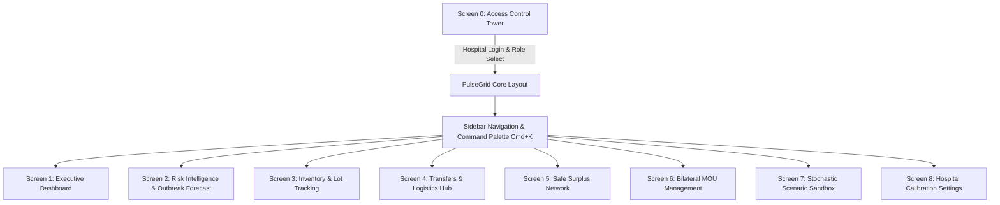

# ⏱️ 5-Minute Quick-Read: PulseGrid AI Frontend Guide

> **Target Audience:** Presenter / Evaluator / Team Member  
> **Read Time:** ~5 Minutes  
> **Key Goal:** Understand the entire frontend architecture, every screen's purpose, key buzzwords to say, and what buttons to click during live evaluation.

---

## 🌟 1. The 30-Second Elevator Pitch (What is this?)

**PulseGrid AI** is an enterprise-grade **Clinical Healthcare Supply Intelligence Platform** (Singularity 2026, Track 2).
It solves hospital drug shortages, inventory expirations, and inter-hospital stock coordination using **predictive AI, FEFO batch tracking, and bilateral regional surplus sharing (MOU network)**.

---

## 🗺️ 2. High-Level Architecture (How it fits together)

- **Tech Stack:** React 19 + Vite + Tailwind CSS + Lucide Icons + Vitest (29 Unit & Integration Tests).
- **Core State Management:** Live navigation state, modal popups, interactive sliders, simulated IoT telemetry, dynamic filter buttons.

---

## 🖥️ 3. Screen-by-Screen Breakdown (What they do & What to click)

| Screen # | Screen Name | Key Problem It Solves | Key Things to Point Out in Demo |
|:---|:---|:---|:---|
| **Screen 0** | **Access Control Tower** | Multi-hospital secure entry, role-based telemetry | • Click **"Fill Demo Credentials"** to instant-autofill. • Toggle between **Inventory Director, Regional Coordinator, Clinical Lead**. • Point out **FDA 21 CFR Part 11 & SOC2** compliance badges. |
| **Screen 1** | **Executive Command Console** | High-level situational awareness across facilities | • **4 KPI Cards:** Total SKUs (1,482), Stockout Risk, Active Inter-Hospital Transfers, Monthly Savings ($428k). • **Red Critical Alert Banner:** Stockout warning for Propofol. • **Recent Activity & Quick Action buttons** to launch emergency rebalance. |
| **Screen 2** | **Risk Intelligence & Outbreaks** | Predict shortages before they occur using Bayesian models | • **Interactive Bayesian MAP curve** with 95% Confidence Interval polygon. • **Syndromic Outbreak Cluster:** Respiratory/ICU surge alert (`+41.8%` expected surge). • Point out the **Confidence Gauge (94.2%)**. |
| **Screen 3** | **Inventory & SKU / Batch Intelligence** | Prevent medication expiration & track defective lots | • **Expandable Lot Breakdowns:** Click `#LOT-99214` to reveal cold-chain IoT temperature logs. • **FEFO (First-Expired, First-Out)** shelf-life progress bars. • **Quarantine & Release** action buttons for compromised batches. |
| **Screen 4** | **Redistribution Hub (Transfers & Logistics)** | Track medication shipments between network hospitals | • **5-Column Kanban Board:** Draft $\rightarrow$ Requested $\rightarrow$ In Transit $\rightarrow$ Cold-Chain Verified $\rightarrow$ Received. • Click transfer card `#TRX-9402` to open the **5-Step DSCSA chain-of-custody verification drawer**. |
| **Screen 5** | **Safe Surplus Network** | Buy or requisition excess stock from nearby partner hospitals | • **Distance Radius Filter:** Click `< 15 km`, `< 30 km`, `< 75 km`. • Surplus catalog showing Norepinephrine, Propofol, Remdesivir. • Click **"Request Rebalance"** to trigger a transfer modal. |
| **Screen 6** | **Collaboration & MOU Management** | Legally binding bilateral hospital resource-sharing agreements | • **Hospital Directory:** St. Jude, Metro General, Valley Children's. • **Section A:** Automatic stock-sharing policy toggles. • **Section B:** Pre-approved therapeutic classes (ICU Vasopressors, Oncology, Antidotes). |
| **Screen 7** | **Scenario Simulation Engine** | Stress-test hospital inventory under catastrophe scenarios | • **3 Interactive Sliders:** Influx Surge (`+15%` to `+150%`), Supply Disruption (`0%` to `100%`), Duration (Days). • **14-Day Dynamic Depletion Curve** (instantly updates with slider changes). • **4 Prescriptive Interventions** with 1-click execution. |
| **Screen 8** | **Hospital Calibration & Settings** | Customize AI lead times, IoT broker, and hospital policies | • **ML Tuning Matrix:** Per-category safety stock multipliers. • **MQTT IoT Broker Config:** Live broker endpoint test modal. • **Floating Diff Bar:** Shows unsaved changes counter and 1-click "Deploy Changes". |

---

## 🔑 4. Five Buzzwords / Key Concepts Judges Will Love

1. **FEFO (First-Expired, First-Out):** Minimizes pharmaceutical waste by automatically prioritizing near-expiry batches.
2. **DSCSA Compliance (Drug Supply Chain Security Act):** End-to-end cryptographic and physical verification of drug shipments.
3. **MCMC Stochastic Simulation (Monte Carlo Markov Chain):** 10,000-run simulation modeling disaster scenarios (pandemics, blizzards, supply disruptions).
4. **Bayesian MAP (Maximum A Posteriori) Forecasting:** Combines historical consumption patterns with real-time syndromic surveillance.
5. **Bilateral MOU (Memorandum of Understanding) Framework:** Allows autonomous, rule-based cross-hospital stock transfers under pre-negotiated legal limits.

---

## 🎬 5. Recommended 60-Second Live Walkthrough Routine

If you have 1 minute to blow away the judges:

1. **Start on Screen 0 (Login):** Hit "Fill Demo Credentials" $\rightarrow$ Click **"Authorize Secure Session"**.
2. **Land on Screen 1 (Dashboard):** Point out the **Propofol critical shortage banner** $\rightarrow$ Click **"Simulate Scenario"** or use the Sidebar.
3. **Show Screen 7 (Simulation Sandbox):** Drag the **Patient Influx Surge slider to 85%** and watch the **14-Day Depletion Curve** drop dynamically to stockout on Day 4.
4. **Show Screen 5 (Safe Surplus Network):** Filter by `< 30 km` to show how nearby hospitals have surplus Propofol.
5. **Show Screen 4 (Transfers Kanban):** Click `#TRX-9402` to show the **DSCSA 5-step Cold-Chain verification stepper**.
6. **Finish:** Emphasize that **29 Vitest automated unit/integration tests** pass cleanly with 0 console errors.

---

## 🛠️ 6. Quick Cheat-Sheet for Navigation & Shortcuts

- **Command Palette:** Press `Ctrl + K` (or `Cmd + K`) anywhere to open the instant search & action palette.
- **Role Switcher:** Click the top-right profile pill on the Dashboard to switch hospital roles.
- **View All Screens:** Use the left sidebar icon list or click the screen switchers in the secondary views.
- **Run Tests Locally:** `cd frontend && npm test` (Runs 29 unit & integration tests).
- **Run Dev Server:** `cd frontend && npm run dev` (`http://localhost:5173`).
