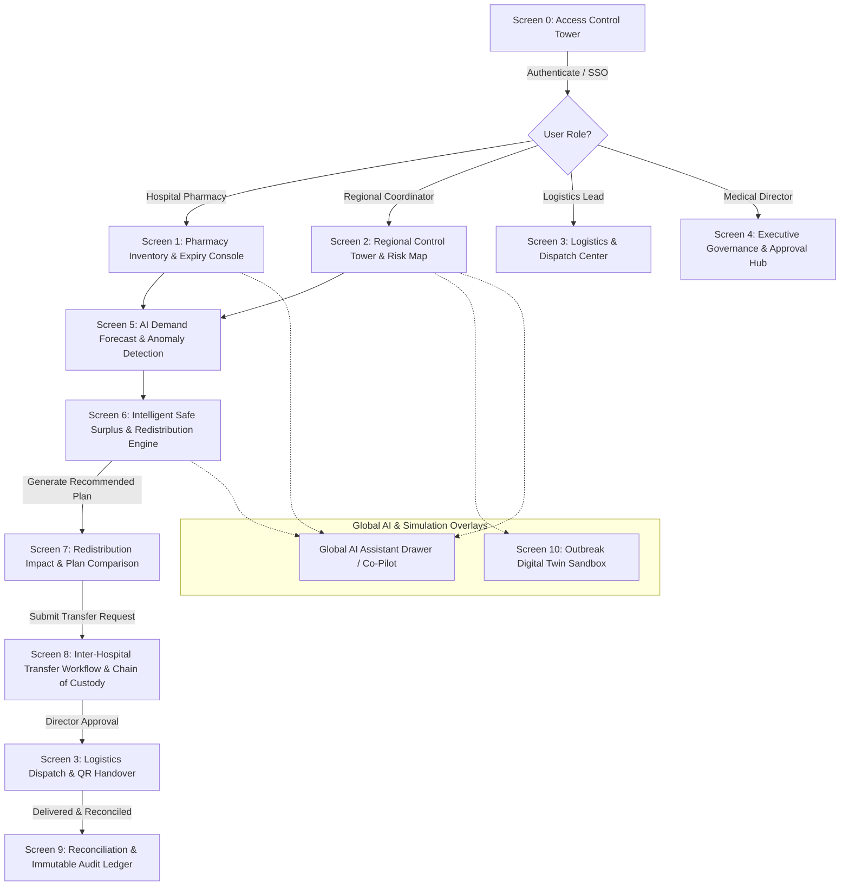
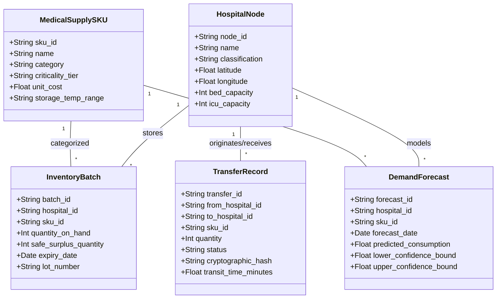

# PulseGrid AI — System Architecture, Feature Blueprint & Screen-by-Screen UX Flow

**Version:** 1.0.0-SEC  
**Classification:** Singularity 2026 — Track 2: AI for Medical Supply Intelligence  
**Author:** PulseGrid Core Engineering Team  

---

## 1. Executive Summary & Problem Formulation

### 1.1 The Healthcare Supply Chain Paradox
Modern healthcare networks suffer from an information asymmetry known as the **Medical Bullwhip Dilemma**:
- **Critical Stockouts:** Individual hospitals experience sudden stockouts of life-saving medical supplies (e.g., Norepinephrine, Propofol, mechanical ventilator circuits, pediatric antivirals) due to localized outbreak spikes or supplier lead-time delays.
- **Simultaneous Expiry Wastage:** Neighboring hospitals within a 30-mile radius often hold excess safety inventory of the exact same SKUs that expire and are incinerated before utilization.
- **Siloed Legacy ERPs:** Existing hospital inventory systems (e.g., Epic, Cerner, SAP) only record point-in-time stock levels. They lack predictive epidemiological surge modeling and cross-facility, privacy-preserving redistribution optimization.

### 1.2 The PulseGrid AI Mission
PulseGrid AI converts passive inventory data into an active, predictive **Supply Intelligence Control Tower**:
1. **Predicts Stockouts Early (7–30 Days Ahead):** Couples time-series machine learning with bio-surveillance outbreak signal detection.
2. **Eliminates Expiry Wastage:** Identifies safe surplus batches nearing expiry and algorithmically routes them to facilities with imminent demand.
3. **Constrained Mathematical Optimization:** Generates optimal, operationally feasible inter-hospital transfers taking into account transit time, transport temperature, shelf-life, and criticality tiers.
4. **Privacy-Preserving & Auditable:** Zero-Knowledge sharing of surplus inventory with immutable cryptographic logs (FIPS 140-3 & SOC2 Type II).

---

## 2. Role-Based Access Control (RBAC) & Persona Matrix

| Persona / Role | Scope & Domain | Primary Responsibilities | Key Actions & Permissions |
| :--- | :--- | :--- | :--- |
| **1. Hospital Pharmacy Lead** (`ROLE_PHARMACY`) | Single Hospital Node (e.g., District Alpha) | Internal stock levels, lot expiry tracking, receiving deliveries, dispensing supplies. | • Log local batch consumption<br>• View local stockout predictions<br>• Flag internal shortage warnings<br>• Accept incoming transfers |
| **2. Regional Network Coordinator** (`ROLE_COORDINATOR`) | District / Regional Grid (All 6 Network Nodes) | Macro bio-surveillance, outbreak monitoring, inter-hospital mutual aid coordination. | • View network-wide risk map<br>• Trigger AI redistribution engine<br>• Run epidemic stress simulations<br>• Initiate inter-hospital transfer offers |
| **3. Logistics & Dispatch Lead** (`ROLE_LOGISTICS`) | Transit Fleet & Strategic Stockpiles | Transport routing, vehicle allocation, cold-chain compliance, chain-of-custody. | • View dispatch queue & waybills<br>• Verify QR/cryptographic handover<br>• Monitor transit telematics & delays<br>• Confirm delivery delivery reconciliation |
| **4. Medical Director / Auditor** (`ROLE_DIRECTOR`) | Institutional Network Governance | High-value overrides, clinical governance, compliance verification, audit trail. | • Approve restricted SKU transfers<br>• Sign off with cryptographic keys<br>• Review SOC2/HIPAA audit logs<br>• Manage facility onboarding requests |

---

## 3. High-Level User Journey & Screen Flow Diagram



---

## 4. Comprehensive Screen-by-Screen Blueprint

---

### Screen 0: Access Control Tower (Auth & Facility Onboarding)
*Status: Implemented in React (`frontend/src/App.jsx`)*

#### Purpose
Secure entry gate enforcing 256-bit TLS hardware encryption, FIPS hardware token verification, institutional SAML/OAuth2 SSO, and multi-tier hospital onboarding.

#### UI Components & Data Layout
1. **Left Clinical Brand & Telemetry Panel:**
   - Real-time bio-surveillance status beacon (`LIVE SYNC`).
   - Network telemetry sparkline (14ms latency, 6 active facilities, 1,420 monitored SKUs).
   - Core capability badges (*Outbreak Spike Detection*, *Expiry-Aware Redistribution*, *Reconciliation Audit Log*).
2. **Right Form Panel (Segmented Tab Bar):**
   - **Sign In Tab:** Institutional Email / Administrator ID, Terminal Access Key, show/hide password toggle, Remember Terminal checkbox, Hardware Key indicator, "Access Control Tower" submit button with cryptographic loader, Enterprise Directory SSO button.
   - **Register Facility Tab:** Lead Administrator, Official Institutional Email, Facility Name, Facility Classification dropdown (*Tertiary*, *District General*, *Community Clinic*, *Strategic Stockpile*), Operational Node Function radio pills (*Pharmacy*, *District Health*, *Logistics*), Password confirmation, Regional Medical Director approval notice.
3. **Persistent Footer:** SOC2 Type II, HIPAA Verified, FIPS 140-3 Hardware Boundary badges, and interactive modals for Protocol Terms, Cryptographic Audit Report, Incident Telemetry, and Key Recovery.

---

### Screen 1: Regional Control Tower & Risk Heatmap
*Primary Users: Regional Network Coordinator, Medical Director*

```
+---------------------------------------------------------------------------------------------------------+
| [PulseGrid Hub]  Node Sec-09 | Regional Command Tower      [LIVE SYNC 14ms] [Clearance Level 4] (User) |
+---------------------------------------------------------------------------------------------------------+
| [KPI 1: Network Stockout Risk: 18.4% ▼] [KPI 2: Imminent Shortages: 3 SKUs] [KPI 3: Expiry Wastage Saved: $142,500] |
+---------------------------------------------------------------------------------------------------------+
|                                    | URGENT ATTENTION QUEUE (Next 48 Hours)                             |
|  REGIONAL NETWORK TOPOLOGY MAP     | ------------------------------------------------------------------ |
|  - District Alpha: [HEALTHY - Green]| • [CRITICAL] Propofol 20ml — District Gamma (Stockout in 18h)     |
|  - Metro General:  [HEALTHY - Green]|   Recommended Fix: Transfer 120 vials from District Alpha (Surplus)|
|  - District Gamma: [WARNING - Red]  | • [EXPIRY RISK] Cefepime 2g — Metro General (Expires in 14 days)  |
|  - St. Jude Clinic:[WARNING - Amber]|   Recommended Fix: Route 80 vials to St. Jude (Surge in Respiratory) |
|  - Regional Depot: [STRATEGIC - 94%]| • [ANOMALY] Saline 1000ml consumption +340% at Memorial North     |
|                                    |   [Action: Run AI Redistribution]   [Action: Dispatch Emergency]   |
+---------------------------------------------------------------------------------------------------------+
| BIO-SURVEILLANCE SIGNAL FEED: Regional RSV/Influenza surge detected in Cluster 3 (Demand multiplier: 1.45x)|
+---------------------------------------------------------------------------------------------------------+
```

#### Key Capabilities
- **Network Risk Index Gauge:** Macro score evaluating overall supply resilience across all nodes.
- **Geographic Facility Topology:** Color-coded node graph (Green = Safe buffer > 14 days, Amber = Warning 3-7 days, Red = Critical < 72 hours).
- **Urgent Triage Feed:** Prioritized list of stockout emergencies and impending expiry risks.
- **Quick Action Bar:** Direct triggers to "Run Redistribution Optimizer" or "Launch Stress Simulation".

---

### Screen 2: Facility Inventory & Batch Intelligence Console
*Primary Users: Hospital Pharmacy Lead, Inventory Specialist*

```
+---------------------------------------------------------------------------------------------------------+
| Facility: District Hospital Alpha | Inventory Console           [+ Add Batch] [Import CSV/ERP] [Export] |
+---------------------------------------------------------------------------------------------------------+
| Filter: [All Categories ▼] [Criticality: Tier 1 ▼] [Status: Low Stock ▼]       [ Search SKU / Batch... ]|
+---------------------------------------------------------------------------------------------------------+
| SKU Name           | Category     | On-Hand | Daily Burn | Days Supply | Expiry Status  | Safe Surplus | Actions     |
|--------------------|--------------|---------|------------|-------------|----------------|--------------|-------------|
| Norepinephrine 4mg | Critical T1  | 350 amp | 45 / day   | 7.7 Days ⚠️ | 3 Lots (8 mos) | 0 (Shortage) | [Forecast]  |
| Propofol 20ml Inj  | Critical T1  | 820 vls | 30 / day   | 27.3 Days   | Lot #901: 18d! | 240 vials    | [Redistrib] |
| Amoxicillin 500mg  | Antibiotics  | 2,400 cp| 110 / day  | 21.8 Days   | 4 Lots (14 mos)| 600 caps     | [Details]   |
| Normal Saline 1L   | IV Fluids    | 410 bgs | 180 / day  | 2.2 Days 🚨 | 2 Lots (24 mos)| 0 (Critical) | [Request]   |
+---------------------------------------------------------------------------------------------------------+
| BATCH EXPIRY DETAIL (Propofol 20ml Selected):                                                           |
| • Lot #A-901: 180 vials | Expiry: Oct 26, 2026 (18 days left) -> ACTION: Offer to Network (FEFO Rule)  |
| • Lot #A-902: 640 vials | Expiry: Mar 15, 2027 (160 days left) -> Local Use                            |
+---------------------------------------------------------------------------------------------------------+
```

#### Key Capabilities
- **Multi-Factor Inventory Grid:** Real-time stock counts, daily consumption rates, and calculated **Days-of-Supply (DOS)**.
- **FEFO (First-Expired, First-Out) Lot Tracker:** Color-coded expiry alerts flagging batches nearing shelf-life limits.
- **Safe Surplus Calculator Column:** Real-time dynamic calculation showing how many units can be safely shared without compromising internal buffer policies.
- **Batch Management Modal:** Form to add new lots, adjust counts, record wastage reasons, or sync with hospital ERP.

---

### Screen 3: AI Demand Forecasting & Outbreak Anomaly Detector
*Primary Users: Regional Coordinator, Hospital Pharmacy Lead*

```
+---------------------------------------------------------------------------------------------------------+
| SKU Intelligence: Norepinephrine 4mg / 4ml | Facility: District Alpha    [Historical: 90D] [Horizon: 14D] |
+---------------------------------------------------------------------------------------------------------+
| FORECAST CHART (Consumption vs AI Projection):                                                          |
| Units                                                                                                   |
|  80 |                             /--- Projected (LightGBM)                                             |
|  60 |                 .--------.-/  --- Upper Bound (95% CI)                                            |
|  40 |    /\  /\  /\.-'                                                                                  |
|  20 | __/  \/  \/                                                                                       |
|   0 +--------------------------------------------------------------------------------                   |
|     Sep 01           Sep 15           Oct 01           Oct 15 (Today)   Oct 22           Oct 29         |
|     [ Historical Actuals (Solid) ]  |  [ AI 14-Day Forecast (Dashed) with 95% Confidence Interval ]   |
+---------------------------------------------------------------------------------------------------------+
| ANOMALY DETECTION ENGINE:                                                                               |
| • Anomaly Detected: ICU admissions up +42% week-over-week due to localized viral pneumonia outbreak.     |
| • Signal Confidence: 94.8% (Correlated with 3 regional telemetry nodes).                                |
| • Predicted Stock-Out Date: Oct 23, 2026 at 14:00 (In 8 Days) without intervention.                    |
| • Recommended Action: Secure 180 ampoules from Regional Stockpile or initiate transfer from Beta.       |
+---------------------------------------------------------------------------------------------------------+
```

#### Key Capabilities
- **Time-Series Forecast Graph:** Interactive visualization comparing historical consumption against LightGBM/ARIMA 7/14/30-day projection curves with upper/lower uncertainty bounds.
- **Epidemic Spike & Seasonality Multiplier:** Dynamic slider allowing coordinators to test "What if patient surge increases by +30% or +50%?".
- **Stockout Countdown Timer:** Exact date/time when buffer stock will hit zero.

---

### Screen 4: Intelligent Safe Surplus & Redistribution Optimizer
*Primary Users: Regional Coordinator, Logistics Lead, Medical Director*

```
+---------------------------------------------------------------------------------------------------------+
| Redistribution Optimizer Engine | Optimization Goal: Zero-Stockout + Minimized Wastage                  |
+---------------------------------------------------------------------------------------------------------+
| Constrained Solver Status: OPTIMAL SOLUTION FOUND (PuLP / OR-Tools in 0.42s)                            |
+---------------------------------------------------------------------------------------------------------+
| RECOMMENDED TRANSFERS (3 Interventions):                                                                |
|                                                                                                         |
| #1 [CRITICAL] Transfer 180 vials Propofol 20ml                                                          |
|    • Origin Facility:      District Hospital Alpha (Surplus: 240 vials, Lot #A-901 expires in 18d)      |
|    • Destination Facility: District Hospital Gamma (Stockout in 18h, Patient load: 92% ICU)             |
|    • Transit Time:         42 mins (Via Route 9 Express, Temp Controlled 15-25°C)                       |
|    • Why this transfer?    Alpha has 27 days supply with expiring stock; Gamma stockouts tomorrow.      |
|    • Impact:               Prevents stockout for 48 ICU patients; eliminates $4,320 in expired drug.    |
|    [Approve Transfer]  [Modify Allocation]  [Reject]                                                    |
|                                                                                                         |
| #2 [MODERATE] Transfer 80 vials Cefepime 2g                                                             |
|    • Origin: Metro General -> Destination: St. Jude Clinic (Transit: 25 mins)                           |
|    [Approve Transfer]  [Modify Allocation]  [Reject]                                                    |
+---------------------------------------------------------------------------------------------------------+
| IMPACT PROJECTION SUMMARY:                                                                              |
| • Projected Stockouts Avoided: 2 Facilities (100% resolution)                                           |
| • Projected Wastage Saved:     $18,940 (260 expiring units rescued)                                     |
| • Total Transport Distance:    54.2 km (Optimal carbon & time route)                                    |
| [APPROVE ENTIRE REDISTRIBUTION PLAN (Cryptographic Signature Required)]                                 |
+---------------------------------------------------------------------------------------------------------+
```

#### Key Capabilities
- **Mathematical Constrained Solver:** Balances shortage urgency, safe surplus, transport transit feasibility, and batch shelf-life.
- **Explainable AI (XAI) Rationale:** Clear, plain-language clinical justification for each recommended transfer.
- **Before-and-After Impact Matrix:** Quantifies stockout reduction % and monetary wastage saved.
- **One-Click Multi-Node Execution:** Generates cryptographic authorization tokens for batch transfer.

---

### Screen 5: Transfer Coordination & Chain-of-Custody Dispatch
*Primary Users: Logistics & Dispatch Lead, Hospital Pharmacy Lead*

```
+---------------------------------------------------------------------------------------------------------+
| Inter-Hospital Transfer Hub | Active Dispatch Board                       [+ Manual Transfer Request]   |
+---------------------------------------------------------------------------------------------------------+
| KANBAN PIPELINE:                                                                                        |
|                                                                                                         |
| [1. PENDING APPROVAL (1)] | [2. READY FOR PICKUP (1)] | [3. IN TRANSIT (2)]     | [4. COMPLETED (8)]   |
| ------------------------- | ------------------------- | ----------------------- | -------------------- |
| TR-9042: Cefepime 80vls   | TR-9040: Propofol 180vls  | TR-9038: Saline 200bgs  | TR-9035: Norepi 60a  |
| Metro Gen -> St. Jude     | Alpha -> Gamma            | Depot -> Metro Gen      | Beta -> Alpha        |
| Awaiting Dr. Vance sign   | Custody: Alpha Pharmacy   | Driver: Unit 4 (Van B)  | Delivered: 10:15 AM  |
| [Review Details]          | QR Code: [Ready to Scan]  | ETA: 18 mins (Cold OK)  | Reconciled: Signed   |
|                           | [Initiate Handover]       | [Track Live GPS/Temp]   | [View Ledger Proof]  |
+---------------------------------------------------------------------------------------------------------+
| TRANSFER MANIFEST (TR-9040 Selected):                                                                   |
| • Sender: District Alpha Pharmacy (Signature: SHA256:4a8b...verified)                                  |
| • Carrier: MedTrans Unit 2 | Cold Chain Req: 15-25°C | Current Sensor: 19.4°C (Normal)                  |
| • Recipient: Gamma Emergency Pharmacy | Expected Arrival: 16:45 Today                                   |
+---------------------------------------------------------------------------------------------------------+
```

#### Key Capabilities
- **Interactive Kanban Board:** Tracks transfers through every milestone (*Pending Approval* -> *Ready for Pickup* -> *In Transit* -> *Completed*).
- **Cryptographic Chain of Custody:** Digital QR scan at pickup and delivery to ensure zero medication diversion or tampering.
- **Cold Chain Telemetry Integration:** Monitors temperature-sensitive shipments in transit.

---

### Screen 6: Outbreak Digital Twin & Stress Simulation Sandbox
*Primary Users: Regional Network Coordinator, Medical Director*

```
+---------------------------------------------------------------------------------------------------------+
| Outbreak Digital Twin Sandbox | Simulation Mode (Non-Production Safe Environment)                      |
+---------------------------------------------------------------------------------------------------------+
| CONFIGURE SIMULATION SCENARIO:                                                                          |
| • Outbreak Profile:     [ Novel Respiratory Strain Delta ▼ ]                                            |
| • Severity Multiplier:  [ =====|============= ] +65% Emergency Admission Surge                         |
| • Supply Disruption:    [x] Global Lead Time Delay on Antibiotics (+14 Days)                            |
| • Simulation Duration:  [ 30 Days Forecast Horizon ]                                                    |
|                                                                     [ RUN DIGITAL TWIN SIMULATION ]     |
+---------------------------------------------------------------------------------------------------------+
| SIMULATION COMPARISON RESULTS (30-Day Outlook):                                                         |
|                                                                                                         |
| METRIC                    | WITHOUT PULSEGRID AI (Status Quo)  | WITH PULSEGRID AI OPTIMIZATION         |
|---------------------------|------------------------------------|----------------------------------------|
| Network Stockout Days     | 42 Cumulative Facility Days        | 2 Cumulative Days (-95.2% reduction)   |
| Patients Affected by Stk  | 380 ICU Patients                   | 12 ICU Patients (-96.8% reduction)     |
| Expired Supply Wastage    | $84,200                            | $6,100 (-92.7% wastage reduction)      |
| Inter-Hospital Transfers  | 0 (Isolated nodes)                 | 14 Coordinated Mutual Aid Transits     |
+---------------------------------------------------------------------------------------------------------+
```

#### Key Capabilities
- **Epidemic Surge Simulator:** Stress-tests hospital stockpiles under simulated pandemics, natural disasters, or port embargoes.
- **Dual-Model Comparative Analytics:** Side-by-side comparison proving the tangible reduction in stockout days and patient morbidity.
- **Exportable Crisis Playbook:** Generates printable emergency procurement plans for healthcare authorities.

---

### Screen 7: PulseGrid AI Assistant (Interactive Copilot Modal/Drawer)
*Primary Users: All Roles (Context-aware responses)*

```
+---------------------------------------------------------------------------------------------------------+
| PulseGrid AI Clinical Supply Copilot (LLM-Grounded to Real-Time Inventory)                        [x]   |
+---------------------------------------------------------------------------------------------------------+
| AI Copilot: "Hello Dr. Vance. I am monitoring 6 regional nodes across 1,420 SKUs. How can I assist?"    |
|                                                                                                         |
| [User]: "Which hospital is running lowest on Propofol and where can we source safe surplus?"            |
|                                                                                                         |
| AI Copilot:                                                                                             |
| "Based on real-time telemetry:                                                                          |
| 1. District Hospital Gamma is currently lowest with 1.2 Days of Supply remaining (Stockout in ~18h).    |
| 2. District Hospital Alpha has 240 vials of safe surplus in Lot #A-901 that expires on Oct 26.          |
| 3. I have prepared Transfer Recommendation TR-9040 (Alpha -> Gamma, 180 vials, 42 min transit).         |
| Would you like me to draft the authorization request for Medical Director sign-off?"                    |
|                                                                                                         |
| [Suggested Action: 'Draft Authorization Request']  [Suggested Action: 'Show Expiry Breakdown']          |
+---------------------------------------------------------------------------------------------------------+
| [ Type a command or question (e.g. 'Simulate a 30% surge in pediatric amoxicillin')...        ] [Send] |
+---------------------------------------------------------------------------------------------------------+
```

#### Key Capabilities
- **Grounded Natural Language Querying:** Answers ad-hoc inventory, forecast, and transfer questions with citations to active data.
- **Proactive Action Suggestions:** Generates clickable workflow actions directly in the chat bubble.
- **Voice & Quick Prompts:** One-tap prompt templates for busy clinicians.

---

### Screen 8: Compliance, Ledger & Cryptographic Audit Portal
*Primary Users: Compliance Auditor, Medical Director*

```
+---------------------------------------------------------------------------------------------------------+
| PulseGrid Cryptographic Audit Log & Verification Ledger         [Download Audit Report (PDF/JSON)]      |
+---------------------------------------------------------------------------------------------------------+
| Compliance Standard: SOC2 Type II, HIPAA Security Rule, FIPS 140-3 Level 3 Hardware Boundary            |
+---------------------------------------------------------------------------------------------------------+
| EVENT TIMESTAMP     | EVENT TYPE          | NODE / USER           | PAYLOAD HASH             | STATUS   |
|---------------------|---------------------|-----------------------|--------------------------|----------|
| Oct 08, 15:20:14 UTC| REDISTRIBUTION_EXEC | Director Vance (SEC)  | SHA256:7f83b165...9d65b  | VERIFIED |
| Oct 08, 14:45:02 UTC| TRANSFER_DISPATCH   | MedTrans Unit 2       | SHA256:3c19e84a...1a02f  | VERIFIED |
| Oct 08, 14:02:11 UTC| BATCH_SURPLUS_OFFER | Alpha Pharmacy        | SHA256:9b821a00...ef41c  | VERIFIED |
| Oct 08, 12:30:55 UTC| NODE_ONBOARDING     | Clinic St. Jude       | SHA256:2e418ca1...88b2a  | VERIFIED |
+---------------------------------------------------------------------------------------------------------+
| ZERO-KNOWLEDGE PROOF VERIFIER:                                                                          |
| • Proof Status: Valid (All surplus shares verified mathematically without revealing non-surplus stock).|
+---------------------------------------------------------------------------------------------------------+
```

---

## 5. Screen-to-Role Permission & Action Matrix

| Screen / Feature Module | Hospital Pharmacy | Regional Coordinator | Logistics Lead | Medical Director / Auditor |
| :--- | :---: | :---: | :---: | :---: |
| **Screen 0: Access Control & SSO** | ✅ Full Access | ✅ Full Access | ✅ Full Access | ✅ Full Access |
| **Screen 1: Regional Control Tower & Risk Map** | 👁️ Local View Only | ✅ Full Access | 👁️ Read-Only | ✅ Full Access |
| **Screen 2: Facility Inventory & Batch Console** | ✅ Manage Local Lots | 👁️ Aggregated View | 👁️ Stock Status | ✅ Audit Access |
| **Screen 3: AI Demand Forecasting** | ✅ Local Predictions | ✅ Network Horizons | ❌ No Access | ✅ Strategic View |
| **Screen 4: Redistribution Optimizer** | 👁️ View My Transfers | ✅ Run & Configure | 👁️ View Queue | ✍️ Sign & Authorize |
| **Screen 5: Transfer Coordination & Dispatch**| ✅ Handover / Receive | 👁️ Monitor Pipeline | ✅ Manage Waybills | 👁️ Oversight |
| **Screen 6: Outbreak Digital Twin Sandbox** | ❌ No Access | ✅ Run Simulations | ❌ No Access | ✅ Policy Analysis |
| **Screen 7: PulseGrid AI Copilot** | ✅ Pharmacy Context | ✅ Network Context | ✅ Route Context | ✅ Executive Context |
| **Screen 8: Cryptographic Audit Ledger** | 👁️ Local Receipts | 👁️ Audit Log | 👁️ Custody Logs | ✅ Export / Attest |

*Legend: ✅ Full Access | 👁️ View-Only / Filtered Access | ✍️ Approval / Sign-off Authority | ❌ Restricted*

---

## 6. Data Model & RESTful API Routing Contract



### Core API Endpoints

1. **Authentication & Identity:**
   - `POST /api/v1/auth/login` — Authenticate institutional user & issue JWT with clearance level.
   - `POST /api/v1/auth/register-facility` — Submit new healthcare facility enrollment payload.
2. **Inventory & Batches:**
   - `GET /api/v1/inventory?hospital_id={id}` — List batch-level supplies with FEFO status.
   - `POST /api/v1/inventory/batch` — Add or adjust local stock lots.
3. **AI Demand Forecasting:**
   - `GET /api/v1/forecast/{hospital_id}/{sku_id}` — Retrieve 14/30-day forecast and anomaly flags.
   - `POST /api/v1/forecast/simulate-surge` — Evaluate impact of hypothetical patient volume surge.
4. **Optimization & Redistribution:**
   - `POST /api/v1/optimization/redistribute` — Execute constrained linear optimization solver.
   - `GET /api/v1/transfers` — Fetch active inter-hospital transfer Kanban board.
   - `POST /api/v1/transfers/{id}/authorize` — Cryptographically approve transfer.
   - `POST /api/v1/transfers/{id}/handover` — Scan and verify custody pickup/delivery.
5. **Digital Twin & Simulation:**
   - `POST /api/v1/simulation/run-scenario` — Run 30-day epidemic digital twin comparison.
6. **Audit & Copilot:**
   - `GET /api/v1/audit/ledger` — Immutable verification trail.
   - `POST /api/v1/copilot/query` — Grounded natural language query engine.

---

## 7. Next Implementation Roadmap

1. **Phase 1 (Complete):** Auth & Onboarding UI with Clinical Design Tokens (`App.jsx`, `Header.jsx`, `LeftTelemetryPanel.jsx`, `AuthFormPanel.jsx`).
2. **Phase 2 (Immediate Next):** Build the **Main Regional Dashboard & Facility Inventory Console** (Screen 1 & Screen 2) with simulated live telemetry and interactive SKU tables.
3. **Phase 3:** Integrate **AI Forecasting Visualizer & Optimization Recommender** (Screen 3 & Screen 4) using Recharts.
4. **Phase 4:** Build the **Transfer Kanban Board & QR Chain-of-Custody Dispatch** (Screen 5).
5. **Phase 5:** Build the **Interactive Outbreak Digital Twin Sandbox** (Screen 6) and **AI Copilot Drawer** (Screen 7).
